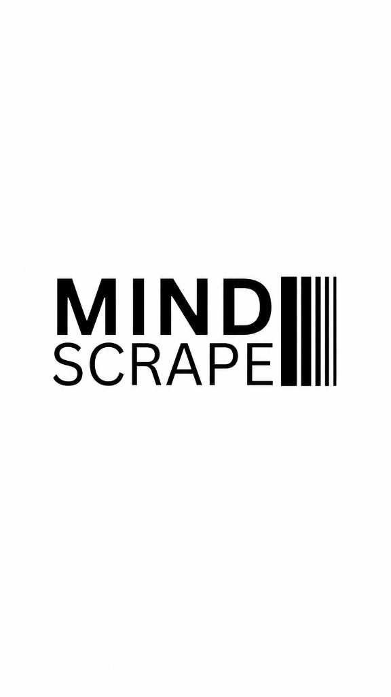

<p align="center">
  
</p>

<p align="center">
  <em>AI updates. IT insights. Future unfolded.</em>
</p>

<p align="center">
  Reusable AI skills for learning, studying, and getting consistent results from any assistant.
</p>

<p align="center">
  <a href="https://github.com/mindscrape9/skills/blob/main/LICENSE">MIT License</a>
  ·
  <a href="docs/">Documentation site</a>
</p>

---

MindScrape is an open collection of **structured AI skills** — human-readable instruction sets that teach an assistant how to perform a specific workflow reliably.

Each skill solves one problem well: faithful document summaries, practice questions, revision aids, and more. Skills are platform-agnostic markdown you can copy into Cursor, Claude Projects, ChatGPT custom workflows, or any tool that supports reusable prompts.

---

## Why MindScrape?

Most AI workflows fail because of one-off prompts. MindScrape skills give models **clear responsibilities**:

- Structured steps instead of vague requests
- Consistent output formats
- Explicit rules that reduce hallucinations
- Transparent processing reports

Every skill is easy to read, modify, and share.

---

## Available skills

| Skill | Description | Docs |
|-------|-------------|------|
| [summarise](skills/summarise/) | Faithful, structured summaries from PDF or DOCX — preserves meaning and page references | [README](skills/summarise/README.md) |

*More skills coming soon: mcq, flashcards, revise, explain, translate, compare, extract, research, grill-me, tdd, code-review.*

---

## Quick start

1. **Browse** the [skills/](skills/) directory.
2. **Open** the skill's `README.md` for usage, options, and examples.
3. **Copy** the skill folder (including `SKILL.md`) into your AI tool's skills or instructions directory.
4. **Invoke** the skill by name and follow the workflow.

Example:

```
@summarise
```

Upload a PDF or DOCX, pick a chapter, and choose Short or Long mode.

---

## Repository structure

```
.
├── assets/              # Brand logo and visual assets
├── docs/                # GitHub Pages documentation site
├── skills/              # All public skills
│   └── summarise/
│       ├── SKILL.md     # Agent instructions (for your AI tool)
│       └── README.md    # Human docs — usage, options, examples
├── LICENSE
└── README.md            # This file — MindScrape landing page
```

---

## Philosophy

Every MindScrape skill follows the same principles:

- Solve one problem well
- Produce consistent outputs
- Minimize hallucinations
- Preserve user intent
- Prefer structured workflows over large prompts
- Be easy to read and modify

---

## Documentation site

For a browsable catalog with brand styling, enable [GitHub Pages](https://pages.github.com/) from the `/docs` folder on your default branch. The site lives at `docs/index.md` and links to each skill page.

---

## Contributing

Contributions are welcome — new skills, workflow improvements, better prompts, bug fixes, and documentation.

Open an issue or pull request if you have an idea that makes a skill more reliable, easier to use, or easier to maintain.

---

## License

Released under the [MIT License](LICENSE). Copyright (c) 2026 MindScrape.

You are free to use, modify, and share these skills for personal or commercial projects. Attribution is appreciated but not required.

---

## Disclaimer

MindScrape skills help AI models perform specific workflows more consistently. Results still depend on the underlying model, input quality, and how clearly you invoke the skill. Always review AI-generated output before relying on it for academic, professional, legal, or medical purposes.

---

<p align="center">Made with care for the open-source AI community.</p>
